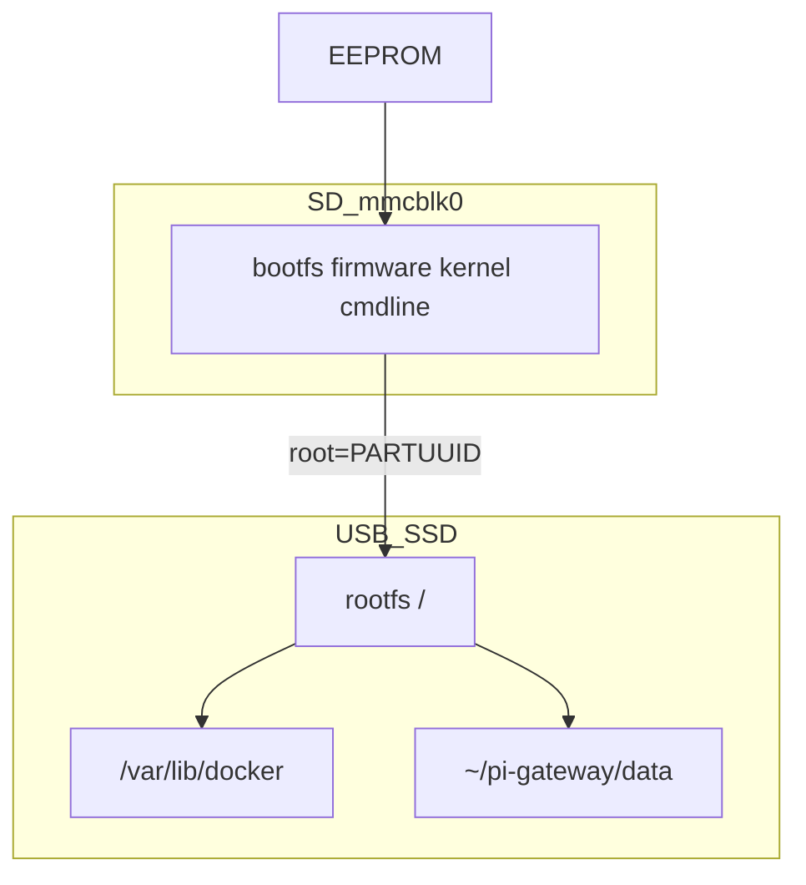

# SD Boot + SSD Rootfs Implementation Plan

> **For agentic workers:** REQUIRED SUB-SKILL: Use superpowers:subagent-driven-development (recommended) or superpowers:executing-plans to implement this plan task-by-task. Steps use checkbox (`- [ ]`) syntax for tracking.

**Goal:** Pi Gateway’de SD kart yalnızca boot partition taşır; rootfs, Docker ve tüm veri USB SSD üzerindedir — SD I/O kaynaklı root-RO döngüsü biter.

**Architecture:** A mimarisi — EEPROM SD’den boot eder; `cmdline.txt` `root=PARTUUID=<ssd>` ile SSD rootfs’e geçer. Hybrid (`STORAGE_TYPE=hybrid`) deprecate; üretim varsayılanı `ssd-root`. Tek SSD partition (ext4); `/mnt/ssd` data-disk modeli kalkar.

**Tech Stack:** Raspberry Pi OS 64-bit Lite, systemd, Docker Compose, mevcut pi-gateway kurtarma scriptleri, Mac Imager/flash scriptleri.

## Global Constraints

- Hedef: `STORAGE_TYPE=ssd-root` (üretim)
- Root device asla `mmcblk` olmamalı (smoke FAIL)
- JMicron quirks + `rootdelay` zorunlu (mevcut USB adaptör)
- EEPROM: `BOOT_ORDER=0xf41` SD-first, USB-first değil
- Cutover öncesi Restic/Mac backup zorunlu
- Faz 1–5 kurtarma kodu deploy edilmeden cutover yapılmaz

---

## Hedef disk düzeni

| Disk | Partition | İçerik |
|------|-----------|--------|
| SD `mmcblk0p1` | FAT32 `bootfs` | firmware, kernel, `cmdline.txt`, `config.txt` |
| SD rootfs | kullanılmaz / wipe | yazma yok |
| SSD `sdXp1` | ext4 | `/` + Docker + home + data |

---

## Faz 0 — Stabilize (migration öncesi)

- [ ] Pi online olunca `mount -o remount,rw /`
- [ ] `./scripts/mac/deploy.sh` (veya `DEPLOY_SKIP_PULL=true` ile hafif) tamamla
- [ ] Smoke yeşil; `recover-ro` Result=success
- [ ] `make backup-pull` veya restic snapshot

---

## Faz 1 — `ssd-root` storage mode

### Dosyalar

- `.env.example`, `docs/ENV.md` — `STORAGE_TYPE=ssd-root`
- `scripts/lib/ensure-data-symlink.sh` — `ssd-root`: native `data/`, symlink yok
- `scripts/pi/setup-docker-ssd.sh` — `ssd-root`: no-op
- `scripts/pi/setup-ssd-data.sh`, `ensure-ssd-fstab.sh` — `ssd-root`: skip
- `scripts/pi/bootstrap.sh`, `smoke-test.sh`, `health-check.sh` — root ≠ mmcblk
- `scripts/mac/validate-stack-health.sh` — yeni contract

### Adımlar

- [ ] `.env.example`: `STORAGE_TYPE=ssd-root` + açıklama; hybrid deprecated notu
- [ ] `ensure-data-symlink.sh`: `needs_ssd_storage` → yalnızca hybrid/ssd-data
- [ ] Smoke: `root-on-ssd` check (`findmnt /` mmcblk değil)
- [ ] Health: mmcblk root → fail + notify
- [ ] Validate Mac script güncelle
- [ ] Docs: ENV + OPERATIONS kısa not

---

## Faz 2 — Migration script

### Yeni dosyalar

- `scripts/mac/migrate-sd-boot-ssd-root.sh` — ana cutover
- `scripts/mac/verify-ssd-root.sh` — cmdline PARTUUID ↔ SSD UUID

### Davranış

1. SD (~32GB) + SSD (~256GB) tespit (`setup-hybrid.sh` finder kalıbı)
2. Çift onay: `CONFIRM=yes` + disk listesi
3. SSD’ye temiz Pi OS Lite yaz (`flash-ssd.sh` / Imager)
4. SSD root PARTUUID oku
5. SD `bootfs` mount → `cmdline.txt`:
   - `root=PARTUUID=... rootfstype=ext4 rootwait rootdelay=15`
   - `usb-storage.quirks=152d:0583:u` (veya tespit edilen)
6. Eski cmdline yedek: `cmdline.txt.bak-pre-ssd-root`
7. Verify script: PARTUUID eşleşmesi, quirks var, resize flag ilk boot için

### Adımlar

- [ ] `migrate-sd-boot-ssd-root.sh` yaz
- [ ] `verify-ssd-root.sh` yaz
- [ ] Dry-run dokümanı: `docs/SSD-ROOT.md` (A mimarisi prosedürü)
- [ ] `docs/SSD-KURULUM.md` güncelle: A = varsayılan, B = alternatif USB boot

---

## Faz 3 — Cutover (elle + script)

- [ ] Mac backup doğrula
- [ ] Eski SSD `pi-gateway-data` varsa Mac’e kopyala veya ikinci partition’da sakla
- [ ] `CONFIRM=yes ./scripts/mac/migrate-sd-boot-ssd-root.sh`
- [ ] Pi: SSD + SD takılı, Ethernet, 3A güç
- [ ] First boot: SSH, `df -h /` → SSD
- [ ] `.env` → `STORAGE_TYPE=ssd-root`
- [ ] `make install` / deploy
- [ ] Data restore (rsync veya restic)

---

## Faz 4 — Temizlik + doğrulama

### Kaldır / disable (`ssd-root` altında)

- [ ] `/mnt/ssd` fstab satırları (eski hybrid)
- [ ] `pi-ssd-data.service` enable değil
- [ ] `pi-data-symlink.timer` gereksizse disable
- [ ] `STORAGE_FALLBACK_SD` / core-dns-on-SD path: `ssd-root`’ta skip
- [ ] Docker dual `data-root=/mnt/ssd/docker` yok

### Koru

- tmpfs lock, remount-before-lock, `root_rw_ok`, watchdog, health-check

### Doğrulama

- [ ] `findmnt -n -o SOURCE /` SSD
- [ ] Deploy + smoke tam yeşil
- [ ] `reboot-smoke.sh post` → recover success + root RW
- [ ] SD’ye yazma: yalnızca `/boot` mount (firmware update)

---

## Başarı kriterleri

1. Root asla `mmcblk` değil
2. Deploy sırasında root RO yok
3. Reboot sonrası manuel remount gerekmez
4. Smoke + auth + n8n webhook yeşil
5. Hybrid artefaktları production path’te yok

## Risk mitigasyonu

| Risk | Mitigasyon |
|------|------------|
| Yanlış disk wipe | Size heuristic + `CONFIRM=yes` + list disks |
| JMicron gecikme | quirks + rootdelay + EEPROM USB_MSD_* |
| Veri kaybı | backup-pull + data kopya cutover öncesi |
| Boot loop | cmdline.bak + SD takılı test |

## Scope dışı

- Tam USB SSD boot (B)
- Initramfs emergency shell DNS
- İkinci SSD / RAID
