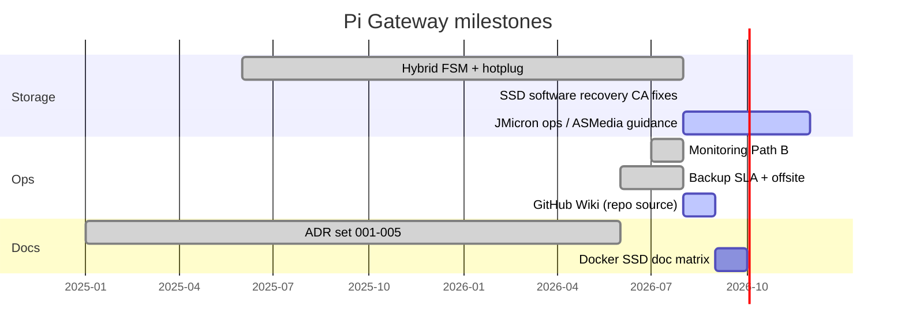

# Roadmap

Status legend: **Done** | **Now** | **Next** | **Later**

Tracked work lives here and in [GitHub Issues](https://github.com/batu3384/pi-gateway/issues). Security: [Security](Security.md) / [Security Advisories](https://github.com/batu3384/pi-gateway/security/advisories).

> Milestones only — not a feature wishlist.

## Now

| Item | Status | Notes |
|------|--------|-------|
| JMicron SSD hardware stability | Now | `152d:0583` enumerate flaps; software FSM hardened Aug 2026 — ASMedia enclosure or USB2/power still ops decision |
| Wiki sync from `wiki/` | Now | `scripts/sync-wiki.sh`; source in repo |
| Offsite backup SLA monitoring | Now | `make backup-pull`, SLO stamps in `state.json`; soft-fail in health-check |

## Next

| Item | Status | Notes |
|------|--------|-------|
| ADR/docs Docker SSD matrix | Next | Audit CA-002 (`docs/adr/001-storage-hybrid.md`) — document `ENABLE_DOCKER_SSD` restore paths |
| Issue triage backlog | Next | Use GitHub Issues for bugs; no open issues baseline Aug 2026 |

## Later

| Item | Status | Notes |
|------|--------|-------|
| Optional SSD-root migration | Later | Experimental `docs/SSD-ROOT.md` — not default hybrid |
| Cloudflare Tunnel hardening | Later | Hostname allowlist only (`docs/CLOUDFLARE-TUNNEL.md`) |
| ssd-root boot without SD | Later | EEPROM `BOOT_ORDER=0xf14` — hardware-dependent |

## Done (recent)

| Item | Status | Notes |
|------|--------|-------|
| SSD SMART wear visibility | Done | `pi-gateway-ssd-smart.timer` + smartmontools; runbook OPERATIONS.md |
| Hybrid storage FSM + degraded core-dns | Done | ADR-001, `ssd-hotplug-handler`, Aug 2025–2026 |
| SSD recovery hardening CA-001..007 | Done | notify split, xhci auto on dropout, ghost block, Aug 2026 |
| Path B monitoring | Done | Prometheus, Grafana, gateway widget — `docs/VISIBILITY.md` |
| CI validate + gitleaks | Done | `fetch-depth: 0` for multi-commit scans |
| Unified login + TLS default | Done | `UNIFIED_LOGIN`, mkcert pipeline |
| 3-2-1 backup + restore drill | Done | ADR-004, `make backup-restore-drill` |
| Telegram edge notify + bot panels | Done | `notify.sh` transitions, `/menu` bot |

## Timeline (approximate)

## Where to propose changes

| Type | Channel |
|------|---------|
| Bug / feature | [Issues](https://github.com/batu3384/pi-gateway/issues) |
| Security | [Security Advisories](https://github.com/batu3384/pi-gateway/security/advisories) |
| Architecture | PR + update `docs/adr/` |
